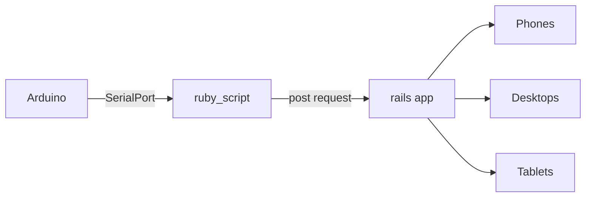

# Arduino_And_Rails
This repo has 3 main important parts


## Arduino Part
### Components
| The Arduino UNO has a ultrasonic sensor, the URM37 V4.0|And these are the connections|
|------------|-------------|
|  |  |

And then every second **Arduino** sends the signal from the ultrasonic sensor to the __Serial Port__

##  'Ruby Script'
The 'script' has two main parts:

| Reading the Arduino output | Sending the request to the rails app |
|------------|-------------|
| In this part the script reads the data from the **Serial Port** and convert it to integer | Then if the data (number) is less or equal to 10(cm) the it will send a **post** request to the rails app |

**It's important that  in the** ```port_str = "/dev/ttyS6" ``` **you change it and set it to the COM Port that the Arduino is using on your computer**

## Rails App
The rails app will read the post request the ruby script send and will create a new row in the database and will show it in the **posts** route

To run the server remember to run ```$ bundle install```  and ``` $ rails db:setup ``` to setup the data base

## Instructions
### To run all
* Plug in your Arduino and upload the code
* While is plugged in run the ruby_script.rb file with ```ruby ruby_script.rb```
* Then run the server by typing ```rails s```
